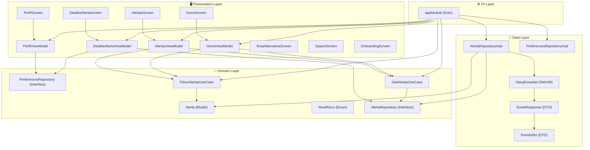
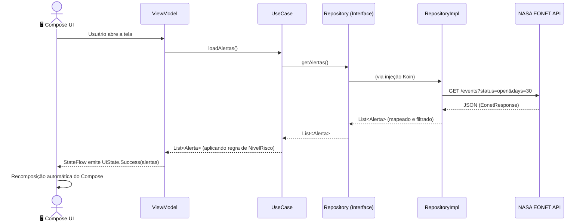
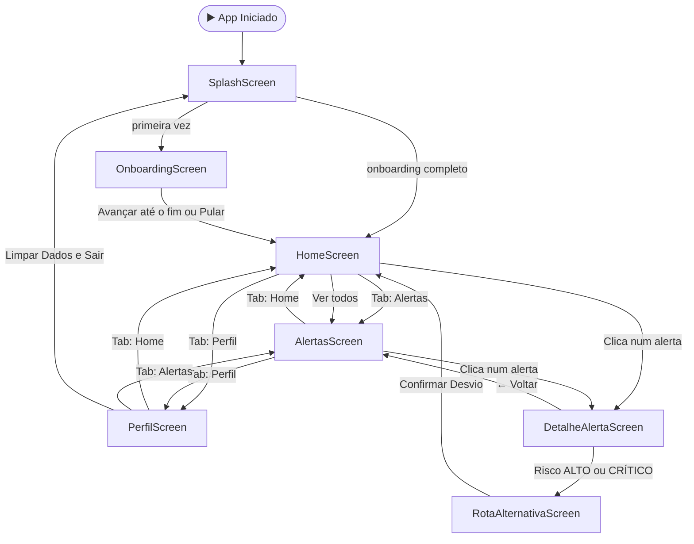

# 🏗️ Documento de Arquitetura — SkyLog Motorista (Android)

> **Projeto:** SkyLog Motorista | **Tipo:** MVP Acadêmico (Global Solution FIAP 2026.1)
> **Stack:** Kotlin · Jetpack Compose · Clean Architecture · MVVM

Este documento descreve as decisões arquiteturais e o design técnico do aplicativo SkyLog Motorista. O objetivo é registrar formalmente o *porquê* de cada escolha tecnológica, servindo como referência de onboarding e avaliação técnica do projeto.

---

## 1. Visão Geral da Arquitetura

O projeto adota **Clean Architecture** em conjunto com o padrão **MVVM (Model-View-ViewModel)**, organizando o código em camadas de responsabilidade isoladas e unidirecionais. A regra fundamental é: **as camadas internas não conhecem as externas**.

```
┌────────────────────────────────────────────┐
│            PRESENTATION (UI)               │
│  Screens (Compose) · ViewModels · UiState  │
├────────────────────────────────────────────┤
│               DOMAIN (Negócio)             │
│  UseCases · Models · Repository Contracts  │
├────────────────────────────────────────────┤
│                DATA (Dados)                │
│  Repository Impls · Retrofit · DTOs        │
├────────────────────────────────────────────┤
│           DI (Injeção de Dependência)      │
│              Koin · appModule              │
└────────────────────────────────────────────┘
```

---

## 2. Diagrama de Camadas e Componentes

O diagrama abaixo mostra todas as classes do projeto e suas respectivas camadas:



---

## 3. Fluxo de Dados (Da NASA até a Tela)

O diagrama abaixo representa o caminho percorrido por um dado desde a requisição na API da NASA até ser exibido na interface do usuário:



---

## 4. Fluxo de Navegação (Entre Telas)

O diagrama abaixo mapeia todos os fluxos de navegação possíveis dentro do app:



---

## 5. ADRs — Architecture Decision Records

Cada decisão abaixo foi tomada com base nas necessidades do MVP e nos padrões do mercado Android atual.

### ADR-001: Jetpack Compose vs. XML Views
- **Decisão:** Jetpack Compose
- **Justificativa:** O Compose é o padrão oficial e moderno do Android. Sua natureza declarativa alinha perfeitamente com o MVVM (a UI é uma função do estado), elimina a necessidade de `ViewBinding` e reduz drasticamente o código boilerplate de UI.
- **Trade-off:** Curva de aprendizado inicial maior para quem vem do XML tradicional.

### ADR-002: Koin vs. Hilt (Dagger)
- **Decisão:** Koin
- **Justificativa:** Como projeto MVP, a velocidade de desenvolvimento foi priorizada. O Koin é uma biblioteca Kotlin-first de DI que não depende de `annotation processing` (kapt/ksp), acelerando o build e simplificando a configuração em comparação com o Hilt.
- **Trade-off:** O Hilt oferece verificação em tempo de compilação das dependências, o que o Koin não faz. Em um projeto de produção em escala, Hilt seria avaliado.

### ADR-003: StateFlow vs. LiveData
- **Decisão:** StateFlow (Kotlin Coroutines)
- **Justificativa:** O `StateFlow` é agnóstico ao ciclo de vida do Android (não precisa de `LifecycleOwner`), o que facilita o teste unitário dos ViewModels. Combinado com `collectAsState()` do Compose, o binding de dados é natural e reativo.
- **Trade-off:** Requer atenção ao escopo de coleta para evitar vazamentos de memória em apps mais complexos.

### ADR-004: NASA EONET API vs. Firebase/Backend próprio
- **Decisão:** NASA EONET API
- **Justificativa:** A API EONET (Earth Observatory Natural Event Tracker) é pública, sem autenticação, e fornece dados reais de desastres naturais do mundo. Essa escolha eliminou a necessidade de gerenciar um backend, um banco de dados e chaves de API secretas, tornando o repositório 100% autossuficiente e auditável.
- **Trade-off:** Os dados são globais (não filtrados para o Brasil especificamente) e podem ter latência variável dependendo da carga nos servidores da NASA.

### ADR-005: UiState Sealed Class vs. Boolean flags
- **Decisão:** `UiState` como sealed class (`Initial`, `Loading`, `Success<T>`, `Error`)
- **Justificativa:** Modelar o estado da UI como um tipo fechado (sealed class) torna impossível o app estar em um estado inválido (ex: `isLoading = true` e `data != null` ao mesmo tempo). O compilador Kotlin garante que todos os estados sejam tratados no `when`.

---

## 6. Contrato da API Externa

| Propriedade | Valor |
|---|---|
| **Provider** | NASA — Earth Observatory Natural Event Tracker (EONET) |
| **Base URL** | `https://eonet.gsfc.nasa.gov/api/v3` |
| **Autenticação** | Nenhuma (Open Data) |
| **Endpoint principal** | `GET /events` |
| **Parâmetros utilizados** | `status=open`, `days=30`, `limit=50` |
| **Formato de resposta** | `application/json` |
| **Mapeamento de categorias** | `wildfires` → Queimada · `severeStorms` → Tempestade · `floods` → Enchente · `landslides` → Deslizamento |
